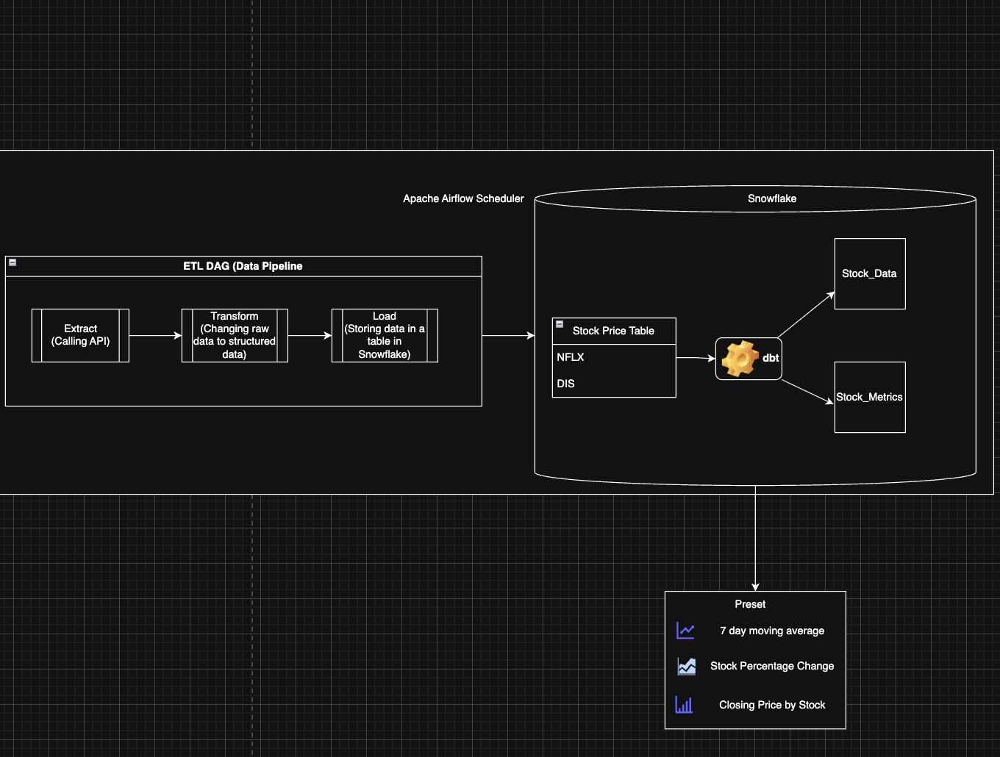
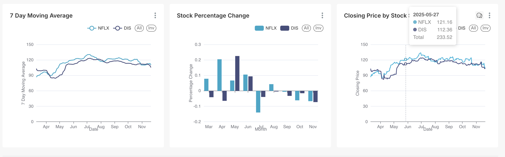
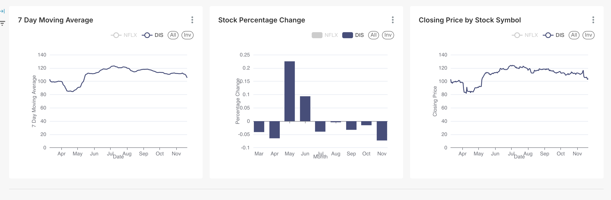

# End-to-End Stock Analytics Pipeline
**Course:** DATA 226 - Data Warehouse and Pipeline  
**Authors:** Benita Isaac and Shruthi Thirukumaran
**Tools:** Airflow • Snowflake • dbt • Superset (or Preset/Tableau)

---

## 🎯 Objective
Build an **end-to-end data analytics system** that extracts stock-price data, loads it into Snowflake, transforms data with dbt, and visualizes key metrics in a BI tool.  

---
## System Architecture 



This project uses a modern ELT pipeline that moves data from extraction to analytics using Airflow, Snowflake, and dbt:

- **Airflow (ETL):** Extracts stock data from Yahoo Finance, performs light cleaning, and loads raw records into the Snowflake `RAW` schema.
- **Snowflake (Storage):** Stores raw and transformed datasets in separate schemas (`RAW` and `ANALYTICS`) to maintain clear data lineage.
- **dbt (ELT):** Transforms raw data into clean staging models and analytics-ready fact tables, applies data tests, and manages historical snapshots.
- **Airflow Orchestration:** A second DAG runs `dbt run/test/snapshot` after ETL completes, ensuring an automated and idempotent end-to-end workflow.

This architecture separates ingestion, transformation, and analytics layers while enabling reproducible, scheduled, and scalable data processing.


---

## 🧩 Components

### 1️⃣ Airflow – ETL Pipeline
**File:** `airflow/dags/stock_price_etl_dag.py`  
- Extracts historical stock data from the **yfinance** API (e.g., DIS and NFLX).  
- Transforms the raw API output into a standardized tabular format.  
- Loads data into the Snowflake table `RAW.TWO_STOCK_V2`.  
- Ensures **idempotent loading** using a staging table and a MERGE-based upsert pattern.  
- Uses Airflow configuration elements:  
  - **Variables**:  
    - `stock_symbols` → `"DIS,NFLX"`  
    - `lookback_days` → `180`  
  - **Connection**:  
    - `snowflake_conn` → Snowflake authentication and warehouse settings.

---

### 2️⃣ Airflow – dbt ELT Pipeline
**File:** `airflow/dags/dbt_elt_dag.py`  
- Executes dbt inside the Airflow container using a dedicated virtual environment.  
- Runs the ELT workflow in sequence:  
  1. `dbt run` → builds **staging** and **fact** models in Snowflake.  
  2. `dbt test` → validates data quality (not-null, unique, relationship tests).  
  3. `dbt snapshot` → records historical versions of stock data using dbt snapshots.  
- Configured to run **automatically after** the ETL pipeline via `TriggerDagRunOperator`.  
- Uses:  
  - dbt venv at `/home/airflow/dbtvenv`  
  - Mounted dbt project at `/opt/airflow/dbt`

---

### 3️⃣ dbt – Modeling, Testing, and Snapshots
**Folder:** `dbt/stock_analytics/`  
- Implements SQL-based transformations inside Snowflake.  
- Core models:  
  - `stg_stock_data.sql` → cleans and standardizes raw stock data.  
  - `fct_stock_metrics.sql` → computes 7-day/30-day moving averages and daily percent change.  
- **Tests** defined in `schema.yml`:  
  - `not_null`, `unique`, `relationships`, and custom constraints.  
- **Snapshots** (e.g., `stock_prices_snapshot.sql`) track historical record changes over time.

---

### 4️⃣ BI Visualization – Preset (Superset)
- Connects directly to Snowflake’s **ANALYTICS** schema.  
- Interactive dashboard includes:  
  - Line chart for daily closing price and moving averages.  
  - 7-day moving average trend chart.  
  - Monthly aggregated percentage-change bar chart.  
- Symbol filtering (e.g., DIS vs. NFLX) demonstrates dashboard interactivity.  
- Validates that ELT outputs are accurate and suitable for analysis.







---

# ⚙️ Setup & Run

## 1. Clone Repo
git clone https://github.com/benitaisaac/snowflake-airflow-dbt-analytics.git
cd snowflake-airflow-dbt-analytics

## 2. Create & Activate Virtual Environment
python3 -m venv env1
source env1/bin/activate
pip install -r requirements.txt

## 3. Initialize Airflow
airflow db init

## 4. Start Airflow
### Terminal 1
airflow scheduler
### Terminal 2
airflow webserver -p 8080
### UI: http://localhost:8080

## 5. Configure Airflow (UI)
- Add Snowflake connection: `snowflake_conn`
- Add Variables:
    - stock_symbols = DIS,NFLX
    - lookback_days = 180

## 6. Run ETL DAG
Trigger `stock_price_etl_dag` in Airflow UI.

## 7. Run dbt Models
cd dbt/stock_analytics
dbt run
dbt test
dbt snapshot

## 8. Verify in Snowflake
```SELECT * FROM RAW.TWO_STOCK_V2;```

```SELECT * FROM ANALYTICS.STG_STOCK_DATA;```

```SELECT * FROM ANALYTICS.FCT_STOCK_METRICS;```

